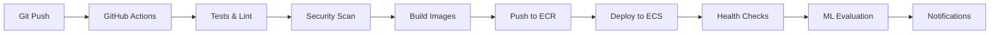

# 🚀 AWS Production Deployment Guide

This guide covers the complete AWS production deployment for the Hotel Review NLP application using Infrastructure as Code, CI/CD pipelines, monitoring, and ML model evaluation.

## 🏗️ Architecture Overview

The application is deployed using a modern, scalable AWS architecture:

```
┌─────────────────────────────────────────────────────────────────┐
│                        AWS Cloud Architecture                   │
├─────────────────────────────────────────────────────────────────┤
│                                                                 │
│  ┌──────────┐    ┌─────────────┐    ┌──────────────┐          │
│  │   Route  │    │ Application │    │    Private   │          │
│  │    53    │───▶│ Load Balancer│───▶│   Subnets    │          │
│  │   (DNS)  │    │    (ALB)    │    │    (ECS)     │          │
│  └──────────┘    └─────────────┘    └──────────────┘          │
│                                                                 │
│  ┌──────────┐    ┌─────────────┐    ┌──────────────┐          │
│  │    ECR   │    │     ECS     │    │   Database   │          │
│  │ (Docker  │───▶│   Fargate   │───▶│   Subnets    │          │
│  │Images)   │    │ (Containers)│    │   (RDS)      │          │
│  └──────────┘    └─────────────┘    └──────────────┘          │
│                                                                 │
│  ┌──────────┐    ┌─────────────┐    ┌──────────────┐          │
│  │    S3    │    │ CloudWatch  │    │    SNS       │          │
│  │(ML Models│    │(Monitoring) │    │  (Alerts)    │          │
│  │& Logs)   │    │             │    │              │          │
│  └──────────┘    └─────────────┘    └──────────────┘          │
│                                                                 │
│  ┌─────────────────────────────────────────────────────────────┤
│  │                     CI/CD Pipeline                          │
│  │  GitHub Actions → ECR → ECS → Lambda (ML Evaluation)       │
│  └─────────────────────────────────────────────────────────────┘
└─────────────────────────────────────────────────────────────────┘
```

## 📋 Prerequisites

Before deploying, ensure you have:

### Required Tools
- **AWS CLI v2** - [Install Guide](https://docs.aws.amazon.com/cli/latest/userguide/getting-started-install.html)
- **Terraform ≥ 1.5.0** - [Install Guide](https://developer.hashicorp.com/terraform/tutorials/aws-get-started/install-cli)
- **Docker** - [Install Guide](https://docs.docker.com/get-docker/)
- **Git** - [Install Guide](https://git-scm.com/downloads)
- **jq** (JSON processor) - [Install Guide](https://stedolan.github.io/jq/download/)

### AWS Account Setup
1. **AWS Account** with administrative permissions
2. **Configured AWS CLI** with appropriate credentials
3. **Domain name** (optional, for custom DNS)

```bash
# Configure AWS CLI
aws configure

# Verify access
aws sts get-caller-identity
```

## 🚀 Quick Deployment

### 1. Clone and Setup
```bash
git clone https://github.com/sudarshantanwer/hotel-review-nlp.git
cd hotel-review-nlp
```

### 2. Deploy Infrastructure
```bash
# Make deployment script executable
chmod +x scripts/deploy.sh

# Deploy to production (default)
./scripts/deploy.sh

# Deploy to specific environment
./scripts/deploy.sh staging us-west-2
```

### 3. Verify Deployment
The script will output the application URLs and monitoring dashboards:
```
=== DEPLOYMENT INFORMATION ===
Application URL: http://hotel-review-nlp-prod-alb-123456789.us-east-1.elb.amazonaws.com
API URL: http://hotel-review-nlp-prod-alb-123456789.us-east-1.elb.amazonaws.com/api
CloudWatch Dashboard: https://us-east-1.console.aws.amazon.com/cloudwatch/...
```

## 🔧 Manual Deployment Steps

### 1. Infrastructure Deployment

```bash
cd aws-infrastructure/terraform

# Initialize Terraform
terraform init

# Create variables file
cat > terraform.tfvars << EOF
aws_region = "us-east-1"
environment = "prod"
project_name = "hotel-review-nlp"
monitoring_email = "your-email@example.com"
github_repo = "your-username/hotel-review-nlp"
EOF

# Plan and apply
terraform plan -var-file=terraform.tfvars
terraform apply -var-file=terraform.tfvars
```

### 2. Build and Deploy Applications

```bash
# Get ECR repository URLs
BACKEND_REPO=$(terraform output -raw ecr_backend_repository_url)
FRONTEND_REPO=$(terraform output -raw ecr_frontend_repository_url)

# Login to ECR
aws ecr get-login-password --region us-east-1 | docker login --username AWS --password-stdin $BACKEND_REPO

# Build and push backend
cd ../../backend
docker build -t $BACKEND_REPO:latest .
docker push $BACKEND_REPO:latest

# Build and push frontend
cd ../frontend
docker build -t $FRONTEND_REPO:latest .
docker push $FRONTEND_REPO:latest
```

## 🔄 CI/CD Pipeline Setup

### 1. GitHub Repository Secrets

Add these secrets to your GitHub repository:

```bash
# In GitHub repo: Settings → Secrets and Variables → Actions

AWS_ROLE_TO_ASSUME: arn:aws:iam::123456789012:role/hotel-review-nlp-prod-github-actions-role
ALB_DNS_NAME: hotel-review-nlp-prod-alb-123456789.us-east-1.elb.amazonaws.com
ML_ARTIFACTS_BUCKET: hotel-review-nlp-ml-artifacts-12345678
SLACK_WEBHOOK: https://hooks.slack.com/services/... (optional)
```

### 2. Workflow Configuration

The CI/CD pipeline includes:
- **Code Quality**: Linting, testing, security scanning
- **Build**: Docker image creation and ECR push
- **Deploy**: ECS service updates with zero downtime
- **Monitor**: ML model evaluation and health checks

### 3. Deployment Process



## 📊 Monitoring & Alerting

### CloudWatch Dashboards

Access comprehensive monitoring at:
```
https://us-east-1.console.aws.amazon.com/cloudwatch/home?region=us-east-1#dashboards:name=hotel-review-nlp-prod-dashboard
```

**Monitored Metrics:**
- **Application**: Response time, error rates, request count
- **Infrastructure**: CPU, memory, disk usage
- **Database**: Connections, query performance, storage
- **ML Model**: Accuracy, precision, recall, data drift

### Alert Configuration

Alerts are sent via SNS for:
- High CPU/memory usage (>80%)
- Application errors (>5% error rate)
- Database connection issues
- ML model accuracy drop (<85%)
- Data drift detection

### Custom Monitoring

```bash
# Run ML model evaluation manually
python scripts/evaluate_model.py

# Run comprehensive ML monitoring
python scripts/monitor_ml_model.py
```

## 🔐 Security Features

### Network Security
- **VPC**: Isolated network with public/private subnets
- **Security Groups**: Restrictive ingress/egress rules
- **NAT Gateway**: Secure outbound internet access for private subnets

### Application Security
- **IAM Roles**: Principle of least privilege
- **Secrets Manager**: Encrypted database credentials
- **ECR Scanning**: Container vulnerability scanning
- **ALB**: SSL/TLS termination (when domain configured)

### Data Security
- **RDS Encryption**: At-rest data encryption
- **S3 Encryption**: Server-side encryption for artifacts
- **VPC Endpoints**: Private AWS service access

## 📈 Scaling Configuration

### Auto Scaling
- **ECS Services**: Automatic task scaling based on CPU/memory
- **RDS**: Storage auto-scaling enabled
- **ALB**: Multi-AZ load balancing

### Performance Optimization
- **ECS Tasks**: Right-sized CPU/memory allocation
- **Database**: Performance Insights enabled
- **Caching**: Application-level caching strategies

## 💰 Cost Optimization

### Resource Sizing
- **Production**: `db.t3.micro` RDS, 512 CPU ECS tasks
- **Development**: Smaller instances, single AZ deployment
- **Monitoring**: 30-day log retention, lifecycle policies

### Cost Monitoring
```bash
# Enable AWS Cost Explorer
aws ce get-cost-and-usage --time-period Start=2024-01-01,End=2024-01-31 --granularity MONTHLY --metrics BlendedCost --group-by Type=DIMENSION,Key=SERVICE
```

## 🧪 Testing Strategy

### Automated Testing
```bash
# Backend tests
cd backend
python -m pytest tests/ -v

# Frontend tests  
cd frontend
npm test

# Integration tests
curl -X POST "$ALB_DNS/analyze" -H "Content-Type: application/json" -d '{"text":"Great hotel!"}'
```

### Load Testing
```bash
# Using Apache Bench
ab -n 1000 -c 10 http://$ALB_DNS/

# Using curl for API testing
for i in {1..100}; do
  curl -X POST "$ALB_DNS/analyze" -H "Content-Type: application/json" -d '{"text":"Test review '$i'"}' &
done
```

## 🔄 Backup & Recovery

### Database Backups
- **Automated Backups**: 7-day retention period
- **Point-in-Time Recovery**: Available within backup window
- **Cross-Region Backup**: Configure for disaster recovery

### Application Recovery
```bash
# Restore from backup
aws rds restore-db-instance-from-db-snapshot \
  --db-instance-identifier hotel-review-restored \
  --db-snapshot-identifier hotel-review-backup-snapshot

# Rollback deployment
aws ecs update-service --cluster $CLUSTER_NAME --service $SERVICE_NAME --task-definition previous-task-def
```

## 🚨 Troubleshooting

### Common Issues

#### 1. ECS Task Failures
```bash
# Check service events
aws ecs describe-services --cluster $CLUSTER_NAME --services $SERVICE_NAME

# View logs
aws logs get-log-events --log-group-name /ecs/hotel-review-nlp-prod/backend
```

#### 2. Database Connection Issues
```bash
# Check RDS status
aws rds describe-db-instances --db-instance-identifier hotel-review-nlp-prod-postgres

# Test connectivity from ECS
aws ecs execute-command --cluster $CLUSTER_NAME --task $TASK_ARN --interactive --command "/bin/bash"
```

#### 3. Load Balancer Issues
```bash
# Check target health
aws elbv2 describe-target-health --target-group-arn $TARGET_GROUP_ARN

# View ALB access logs in S3
aws s3 ls s3://hotel-review-nlp-alb-logs/
```

### Debug Commands
```bash
# Get all outputs
terraform output

# Check ECS service status
aws ecs describe-services --cluster hotel-review-nlp-prod-cluster --services hotel-review-nlp-prod-backend

# View CloudWatch logs
aws logs tail /ecs/hotel-review-nlp-prod/backend --follow

# Check ML model evaluation results
aws s3 ls s3://hotel-review-nlp-ml-artifacts/evaluations/ --recursive
```

## 🔄 Updates & Maintenance

### Application Updates
```bash
# Update via CI/CD (recommended)
git push origin main

# Manual update
./scripts/deploy.sh
```

### Infrastructure Updates
```bash
cd aws-infrastructure/terraform
terraform plan
terraform apply
```

### Security Updates
```bash
# Update base images
docker pull python:3.12-slim
docker pull node:18-alpine

# Rebuild and deploy
./scripts/deploy.sh
```

## 📚 Additional Resources

- [AWS ECS Best Practices](https://docs.aws.amazon.com/AmazonECS/latest/bestpracticesguide/)
- [Terraform AWS Provider Documentation](https://registry.terraform.io/providers/hashicorp/aws/latest/docs)
- [FastAPI Deployment Guide](https://fastapi.tiangolo.com/deployment/)
- [React Production Build](https://create-react-app.dev/docs/production-build/)

## 🤝 Support

For issues and support:
1. Check [GitHub Issues](https://github.com/sudarshantanwer/hotel-review-nlp/issues)
2. Review CloudWatch logs and dashboards
3. Check AWS Service Health Dashboard
4. Contact the development team

---

## 📄 License

This project is licensed under the MIT License - see the [LICENSE](../LICENSE) file for details.
